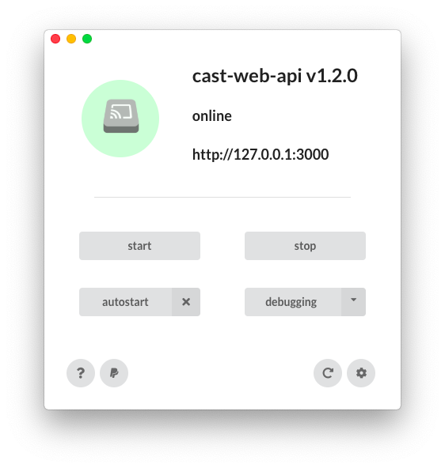

# cast-web-api-desktop

Desktop application for [cast-web-api](https://github.com/vervallsweg/cast-web-api).

## Installation
Download the latest version for your operating system [here](https://github.com/vervallsweg/cast-web-api-desktop/releases) and follow the install instructions on screen.

